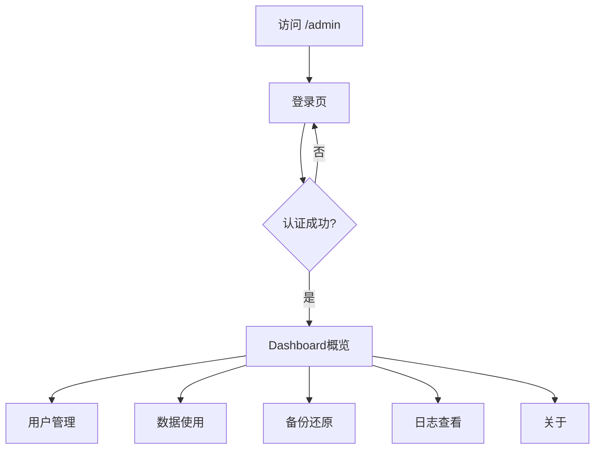

# BoxSync 管理后台 - 产品需求文档

## 1. 产品概述

BoxSync 是一个基于 Docker 部署的轻量级云同步服务器管理后台，为安卓客户端应用提供独立的数据同步空间。管理后台采用暗黑主题设计，提供服务器监控、用户管理、数据备份、日志查看等运维功能。

## 2. 核心功能

### 2.1 用户角色
| 角色 | 说明 | 核心权限 |
|------|------|---------|
| 管理员 | 通过浏览器访问 | 完整的后台管理权限 |

### 2.2 功能模块
1. **登录页**：暗黑风格登录界面，用户名密码认证
2. **Dashboard 概览**：服务器状态监控、CPU/内存/磁盘使用率、文件树浏览
3. **用户管理**：创建、修改、删除、禁用用户
4. **数据使用情况**：查看各用户数据存储统计
5. **备份还原**：数据库导出导入
6. **日志查看**：系统运行日志筛选、导出
7. **关于页面**：版本信息、Redis连接状态

### 2.3 页面详情
| 页面名称 | 模块名称 | 功能描述 |
|---------|---------|---------|
| 登录页 | 登录表单 | 用户名密码输入，JWT认证 |
| Dashboard | 统计卡片 | 在线用户数、系统负载 |
| Dashboard | CPU监控 | 环形进度条展示CPU使用率 |
| Dashboard | 内存占用 | 折线图展示内存趋势 |
| Dashboard | 文件树 | 目录结构浏览 |
| 用户管理 | 用户列表 | 增删改查用户 |
| 数据使用 | 存储统计 | 各用户数据量统计 |
| 备份还原 | 备份操作 | 导出/导入数据库 |
| 日志查看 | 日志列表 | 筛选、分页、导出日志 |
| 关于 | 版本信息 | 服务器版本、Redis状态 |

## 3. 核心流程

管理员打开后台地址 → 输入用户名密码登录 → 进入Dashboard概览页 → 通过侧边栏导航各功能模块。

## 4. 用户界面设计

### 4.1 设计风格
- **主题**：深色暗黑主题，科技感十足
- **主色**：深灰背景 (#1a1a2e, #16213e)，紫色强调色 (#7c3aed, #a78bfa)
- **辅色**：绿色 (#10b981) 用于成功/正常状态，红色 (#ef4444) 用于警告/错误
- **按钮**：圆角矩形，紫色渐变填充
- **字体**：系统默认无衬线字体，中文使用系统默认
- **布局**：左侧固定侧边栏 + 右侧内容区，顶部有面包屑/标题栏
- **图标**：使用 lucide-react 图标库

### 4.2 页面设计概览

#### 登录页
- 整体深色背景，中央登录卡片
- 卡片带轻微毛玻璃效果/半透明背景
- 标题"暗黑登录"白色大字
- 两个输入框：用户名（带用户图标）、密码（带锁图标）
- 紫色渐变登录按钮
- 输入框深色背景，带圆角

#### Dashboard 概览页
- 顶部统计卡片行：当前在线人数、系统负载
- 左侧 CPU 监控区：大型环形进度条（紫绿渐变），中间显示百分比
- CPU 详情列表：CPU使用率、内存占用、磁盘空间
- 左下角内存占用折线图：紫色渐变填充
- 右侧文件树：层级目录结构，带文件夹/文件图标，彩色标签

#### 侧边栏
- 深色背景，紫色激活状态
- 图标 + 文字菜单项：概览、监控、文件、设置
- 顶部 Logo 区域

### 4.3 响应式设计
- 桌面端优先设计
- 侧边栏可折叠
- 内容区自适应宽度

## 5. 技术栈

- **前端框架**：React 18 + TypeScript
- **构建工具**：Vite
- **样式**：Tailwind CSS
- **UI组件**：自定义组件（基于设计图）
- **图表**：自定义 SVG + CSS 实现环形图、Canvas/CSS实现折线图
- **状态管理**：Zustand
- **路由**：React Router DOM
- **图标**：lucide-react
