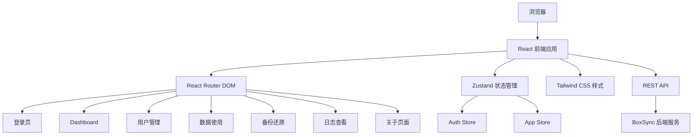

# BoxSync 管理后台 - 技术架构文档

## 1. 架构设计



## 2. 技术描述

- **前端框架**: React@18 + TypeScript
- **初始化工具**: vite-init (react-ts 模板)
- **样式方案**: Tailwind CSS@3
- **状态管理**: Zustand
- **路由**: React Router DOM@6
- **图标**: lucide-react
- **图表**: 自定义 SVG 组件（环形图）、Canvas/CSS（折线图）
- **HTTP客户端**: Fetch API

## 3. 路由定义

| 路由 | 用途 | 权限 |
|------|------|------|
| /admin/login | 管理员登录页 | 公开 |
| /admin/dashboard | Dashboard概览 | 需登录 |
| /admin/users | 用户管理 | 需登录 |
| /admin/storage | 数据使用情况 | 需登录 |
| /admin/backup | 备份还原 | 需登录 |
| /admin/logs | 日志查看 | 需登录 |
| /admin/about | 关于页面 | 需登录 |
| /admin | 重定向到 /admin/dashboard | 需登录 |

## 4. API 定义

### 4.1 认证相关
```typescript
// 登录请求
interface LoginRequest {
  username: string;
  password: string;
}

// 登录响应
interface LoginResponse {
  token: string;
  expiresIn: number;
}
```

### 4.2 用户管理
```typescript
interface User {
  userId: string;
  username: string;
  role: 'admin' | 'user';
  createdAt: number;
  updatedAt: number;
  status: 'active' | 'disabled';
}

interface CreateUserRequest {
  username: string;
  password: string;
  role: 'admin' | 'user';
}
```

### 4.3 存储统计
```typescript
interface StorageStats {
  username: string;
  keyCount: number;
  memoryUsage: number;
  lastSyncTime: number;
}
```

### 4.4 日志
```typescript
interface LogEntry {
  id: string;
  timestamp: number;
  type: 'auth' | 'sync' | 'error' | 'admin';
  action: string;
  userId: string;
  username: string;
  ip: string;
  device?: string;
  detail: string;
  success: boolean;
  errorMsg?: string;
}
```

## 5. 项目目录结构

```
admin-web/
├── src/
│   ├── components/          # 公共组件
│   │   ├── Sidebar.tsx
│   │   ├── Header.tsx
│   │   ├── StatCard.tsx
│   │   ├── CpuRing.tsx
│   │   ├── MemoryChart.tsx
│   │   └── FileTree.tsx
│   ├── pages/               # 页面组件
│   │   ├── Login.tsx
│   │   ├── Dashboard.tsx
│   │   ├── UserManage.tsx
│   │   ├── StorageView.tsx
│   │   ├── BackupRestore.tsx
│   │   ├── LogView.tsx
│   │   └── About.tsx
│   ├── stores/              # Zustand 状态管理
│   │   ├── authStore.ts
│   │   └── appStore.ts
│   ├── api/                 # API 封装
│   │   └── client.ts
│   ├── types/               # TypeScript 类型定义
│   │   └── index.ts
│   ├── App.tsx
│   ├── main.tsx
│   └── index.css
├── index.html
├── package.json
├── tsconfig.json
├── vite.config.ts
└── tailwind.config.js
```

## 6. 状态管理设计

### Auth Store
```typescript
interface AuthState {
  token: string | null;
  isAuthenticated: boolean;
  login: (username: string, password: string) => Promise<void>;
  logout: () => void;
}
```

### App Store
```typescript
interface AppState {
  sidebarCollapsed: boolean;
  currentPage: string;
  toggleSidebar: () => void;
  setCurrentPage: (page: string) => void;
}
```

## 7. 暗黑主题配色

```css
:root {
  --bg-primary: #0f0f1a;
  --bg-secondary: #1a1a2e;
  --bg-card: #16213e;
  --bg-input: #1e1e3f;
  --text-primary: #ffffff;
  --text-secondary: #a0a0b0;
  --accent-purple: #7c3aed;
  --accent-purple-light: #a78bfa;
  --accent-green: #10b981;
  --accent-red: #ef4444;
  --border-color: #2d2d44;
}
```
